# Chap4

## 目录

-   [密码学简史](#密码学简史)
    -   [隐写术与密码学](#隐写术与密码学)
        -   [密码学的基本概念](#密码学的基本概念)
        -   [密码技术的主要用途](#密码技术的主要用途)
    -   [古典密码](#古典密码)
        -   [例子：凯撒密码（PPT第17页）](#例子凯撒密码PPT第17页)
        -   [例子：猪圈密码（PPT第18页）](#例子猪圈密码PPT第18页)
        -   [例子：纵行换位密码（PPT第19页）](#例子纵行换位密码PPT第19页)
    -   [1949年\~1975年：戚继光反切码（PPT第20-21页）](#1949年1975年戚继光反切码PPT第20-21页)
    -   [近代密码 (P.22)](#近代密码-P22)
        -   [ENIGMA机 (P.23-P.26)](#ENIGMA机-P23-P26)
        -   [对称密钥密码系统的缺陷 (P.31)](#对称密钥密码系统的缺陷-P31)
        -   [现代密码 (P.31)](#现代密码-P31)
        -   [量子密码 (P.32-P.33)](#量子密码-P32-P33)
-   [对称密码 ](#对称密码-)
    -   [对称密码算法的两条基本设计原则 (P.35)](#对称密码算法的两条基本设计原则-P35)
    -   [分组密码 (P.37)](#分组密码-P37)
        -   [ECB模式 (P.38)](#ECB模式-P38)
        -   [CBC模式 (P.40)](#CBC模式-P40)
        -   [CFB模式 (P.41)](#CFB模式-P41)
        -   [OFB模式 (P.42)](#OFB模式-P42)
-   [DES(年年讲年年烂，建议看课件）](#DES年年讲年年烂建议看课件)
-   [公钥密码](#公钥密码)
    -   [公钥密码系统的加密原理 (P.64-65)](#公钥密码系统的加密原理-P64-65)
    -   [公钥密码系统的签名原理 (P.66)](#公钥密码系统的签名原理-P66)
    -   [公钥密码算法的表示 (P.67)](#公钥密码算法的表示-P67)
    -   [对公开密钥密码算法的要求 (P.68-69)](#对公开密钥密码算法的要求-P68-69)
    -   [公钥密码算法的误解 (P.603)](#公钥密码算法的误解-P603)
-   [RSA算法简介 (P.70)](#RSA算法简介-P70)
    -   [RSA算法的诞生 (P.71)](#RSA算法的诞生-P71)
    -   [RSA算法的性能表现 (P.73, 74)](#RSA算法的性能表现-P73-74)
    -   [RSA算法的操作过程 (P.604-608)](#RSA算法的操作过程-P604-608)
    -   [公钥密码系统的应用 (P.77)](#公钥密码系统的应用-P77)
-   [摘要与签名](#摘要与签名)
    -   [散列函数 (P.80)](#散列函数-P80)
    -   [散列函数的性质 (P.82)](#散列函数的性质-P82)
    -   [散列函数的安全性：HASH 碰撞 (P.84)](#散列函数的安全性HASH-碰撞-P84)
    -   [哈希算法实例 (P.87)](#哈希算法实例-P87)
    -   [散列函数的应用: 比特币 (P.88)](#散列函数的应用-比特币-P88)
    -   [SHA256算法 (P.89)](#SHA256算法-P89)
    -   [消息认证码 (MAC) (P.97)](#消息认证码-MAC-P97)
    -   [HMAC (P.97)](#HMAC-P97)
    -   [公钥密码与数字签名 (P.98)](#公钥密码与数字签名-P98)
        -   [数字签名方法 (P.100)](#数字签名方法-P100)
        -   [数字签名的分类 (P.101)](#数字签名的分类-P101)
        -   [数字签名的应用 (P.102)](#数字签名的应用-P102)
        -   [密码分析技术 (P.105)](#密码分析技术-P105)
        -   [唯密文攻击(Ciphertext only) (P.106)](#唯密文攻击Ciphertext-only-P106)
        -   [已知明文攻击(Known Plaintext) (P.106)](#已知明文攻击Known-Plaintext-P106)
        -   [选择明文攻击(Chosen Plaintext) (P.106)](#选择明文攻击Chosen-Plaintext-P106)
        -   [选择密文攻击(Chosen Ciphertext) (P.106)](#选择密文攻击Chosen-Ciphertext-P106)
        -   [相关密钥攻击(Related Key) (P.106)](#相关密钥攻击Related-Key-P106)
        -   [密码分析技术 (P.107)](#密码分析技术-P107)

# 密码学简史

密码学是一门历史悠久的学科，大致可以将其发展分为以下三个阶段：

-   **古典密码**：主要是通过替换和移位等简单手段来加密信息。
-   **近代密码**：包括复杂的机械或电子密码机，如二战期间的德国恩尼格玛密码机。
-   **现代密码**：主要指的是计算机时代的密码技术，比如公钥密码和哈希函数等。

## 隐写术与密码学

隐写术和密码学是信息隐藏领域的两个重要分支。他们都关注如何将信息安全地传递到接收者，但是方法和目的有所不同。

-   **隐写术**：源自希腊语，意为“隐秘书写”。它是一门关于信息隐藏的技巧和科学，主要是将信息隐藏在其他无害的信息中，以达到传递秘密信息的目的。
-   **密码学**：源自希腊语，意为“隐藏的书写”。它是一门研究如何隐密地传递信息的学科。密码学的目的不仅仅是隐藏信息，而是确保信息的安全性，包括保密性、完整性和可用性等。

密码学者 *Ron Rivest* 的名言：“密码学是关于如何在敌人存在的环境中通讯”。

### 密码学的基本概念

-   **密码编码**：通过信息编码使信息保密。
-   **密码分析**：用分析方法解密信息。
-   **基本术语**：
    -   明文(plain text)：原始要加密的信息。
    -   密文(cipher text)：经过加密的信息。
    -   加密(encrypt, encryption)：将明文转化为密文的过程。
    -   解密(decrypt, decryption)：将密文转化为明文的过程。
    -   密码算法(Algorithm)、密码(Cipher)：用来加密和解密的数学函数。
    -   密钥(Key)：密码算法中的一个变量。

密码编码主要有以下两种操作：

-   **代替**：每个明文元素映射为另一个元素。
-   **换位**：明文中的元素重新排列。

针对密钥的数量，有以下两种加密方式：

-   **对称加密**：同一个密钥既用于加密又用于解密。
-   **非对称加密**：使用一对密钥，一个用于加密，另一个用于解密。

对明文加密的方式主要有：

-   **块加密**：一次处理一个数据块进行加密。
-   **流加密**：一次处理一个数据单元进行加密。

### 密码技术的主要用途

-   **数据保密**：通过数据加密和解密保护数据的私密性。
-   **认证技术**：实体身份认证和数据源发认证。
-   **信息完整性保护**：保证信息在传输过程中没有被插入、篡改、重发。
-   **数字签名和抗抵赖**：源发抗抵赖和交付抗抵赖。

## 古典密码

古典密码主要包括：

-   **代替密码 (Substitution Cipher)**
-   **换位密码 (Transposition Cipher)**
-   **代替密码与换位密码的组合**

这些密码体制的安全性主要依赖于保持算法本身的保密性。然而，它们都存在以下缺陷：

-   受限算法的缺陷
-   不适合大规模使用
-   不适合人员变动较大的组织
-   用户无法了解算法的安全性

### 例子：凯撒密码（PPT第17页）

凯撒密码是一种代替密码，它将英文字母向前移动k位。~~例如，如果k=5，那么明文 "i went to school this morning" 将被转化为 "n vjsz zu yhmuuq zmny ruxsnsl"。~~

其加密算法可以用数学公式表达为：$c=( m+ k) MOD 26$。

### 例子：猪圈密码（PPT第18页）

### 例子：纵行换位密码（PPT第19页）

纵行换位密码是一种换位密码，明文的字母保持相同，但顺序被打乱了。例如，明文 "Can you understand" 在纵行换位密码中将被转化为 "Codtaueanurnynsd"。这种密码在美国南北战争中得到了广泛的应用。

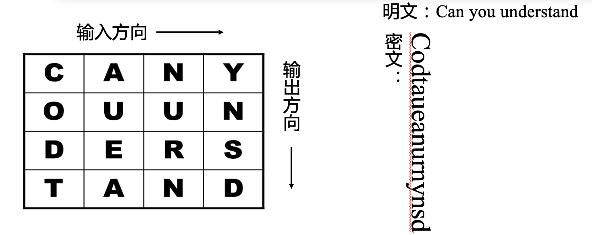

## 1949年\~1975年：戚继光反切码（PPT第20-21页）

戚继光反切码源自反切拼音注音方法，是用两个字为另一个字注音，取上字的声母和下字的韵母，"切"出另外一个字的读音。例如，明文 "5-25-2" 在戚继光反切码中将被转化为 "敌"。

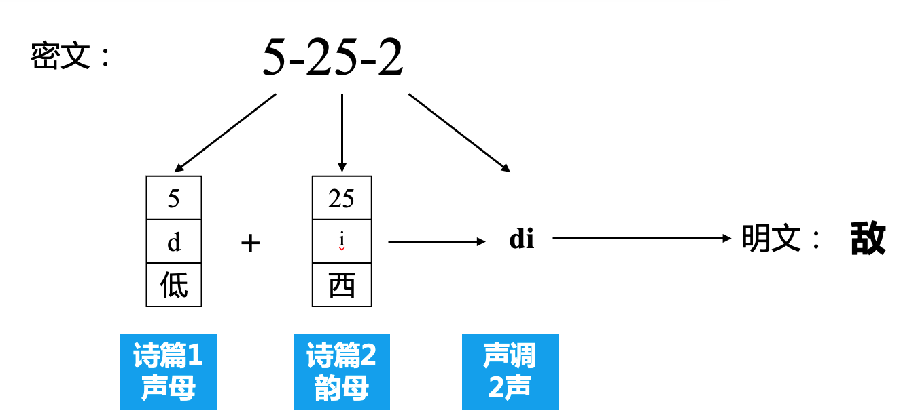

## 近代密码 (P.22)

**近代密码** 的核心是将**算法和密钥分开**。在这种方式中，**密码算法可以公开，密钥保密**，从而将密码系统的安全性放在**保持密钥的保密性**上。

### ENIGMA机 (P.23-P.26)

**ENIGMA机** 是一个由 *Arthur Scherbius* 在1919年发明并在1926年被德军装备的转轮密码机。这个机器使用了一系列的转轮和连接板来创建复杂的加密过程。

-   **工作原理** (P.24-P.26): 它的工作方式基于三个核心要素：转子的初始设置，转子之间的相互位置，以及连接板连线的状况，这三者组合构成了所有可能的密钥。此外，由于每个转子的旋转，使得可能的加密变化在每次输入时都会变化。
-   **工作过程** (P.27):&#x20;

    •根据密码本取得当日密钥

    •首先发送一个新的密钥

    •随机地选择三个字母，比如说PGH

    •把PGH在键盘上连打两遍，加密为比如说KIVBJE（注意两次PGH被加密为不同的形式）

    •把KIVBJE放在在电文的最前面

    •重新调整三个转子的初始方向到PGH

    •正式对明文加密

### 对称密钥密码系统的缺陷 (P.31)

**对称密钥密码系统** 在实践中表现出三个主要的缺陷：

1.  密钥必须经过安全的信道分配。
2.  无法用于数字签名。
3.  密钥管理复杂，随着用户数量的增加，密钥的数量将呈指数级增长，这是因为每个用户都需要与每个其他用户有一个唯一的密钥。

### 现代密码 (P.31)

现代密码的发展在很大程度上归功于**Diffie和Hellman**在1976年的文章《New Direction in Cryptography》中提出的**公钥密码**的概念。这个概念引入了两个密钥的使用，对密钥分配、数字签名、认证等方面产生了深远的影响。此外，他们的方法基于数学函数，而不是代替和换位，被视为密码学历史上唯一的一次真正的革命，实现了密码学发展史上的第二次飞跃。

### 量子密码 (P.32-P.33)

**量子密码** 是一个新兴的密码体系，它采用量子态作为信息载体，经由量子通道在合法的用户之间传送密钥。它的安全性由量子力学原理所保证。

-   **工作原理**：量子密码利用光的偏振状态来编码信息。例如，“水平垂直方向”偏振和“对角方向”偏振可以被用来代表二进制的0和1。
-   **量子密钥生成方法**：在量子密码中，发送方生成并发送偏振，接收方则进行测量。由于量子力学的原理，任何未经授权的测量都会改变量子态，从而被检测到。

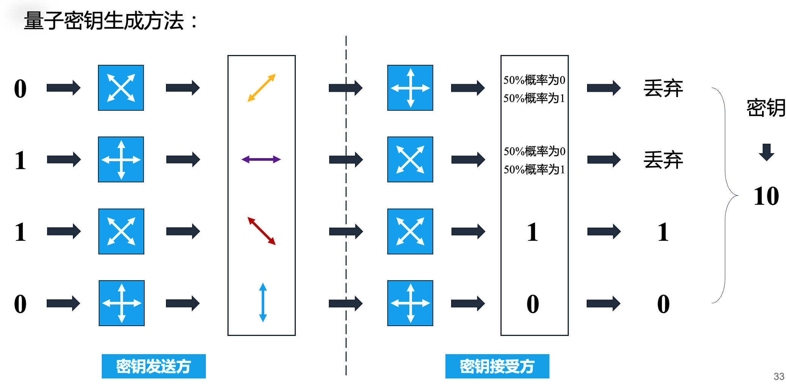

# 对称密码&#x20;

**对称密码**是使用相同的密钥（$K_E=K_D$）进行加密和解密的密码系统。这种系统的密钥需要通过秘密的信道进行分配。常用的对称密钥密码算法包括**DES (Data Encryption Standard)及其各种变体和**AES (Advanced Encryption Standard)。

## 对称密码算法的两条基本设计原则 (P.35)

1.  **扩散（Diffusion）**：重新排列消息中的每一个比特，使明文中的冗余度能够扩散到整个密文，将每一个比特明文的影响尽可能作用到较多的输出密文位中。
2.  **扰乱（Confusion）**：密文和密钥之间的统计特性关系尽可能复杂化。如果密钥的一位发生变化，密文的绝大多数位也发生变化。这两种设计原则是由信息论的创始人克劳德·艾尔伍德·香农提出的。

## 分组密码 (P.37)

**分组密码**是每次只能处理特定长度的一块数据的一类密码算法。对不同分组主要有5种迭代模式：

### ECB模式 (P.38)

在**ECB模式**中，明文分组加密后的结果直接作为密文分组。每个分组的处理相互独立，可以并行操作。一个密文块传输错误不会影响后续密文解密。

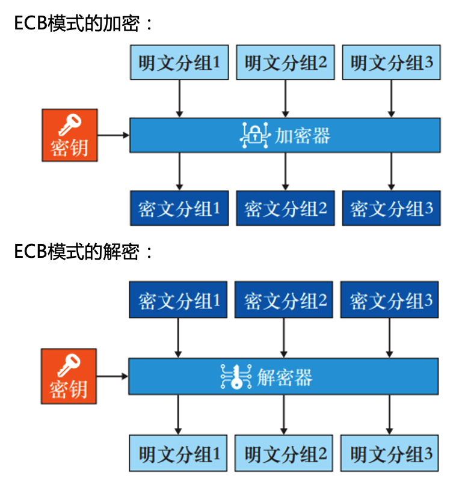

但由于分组相互独立，信息块可被替换、重排、删除、重放，对明文的主动攻击是可能的。

### CBC模式 (P.40)

**CBC模式**能够隐藏明文的数据模式，相同的明文可对应不同的密文，能在一定程度上抵抗主动攻击。但加密不支持并行计算。

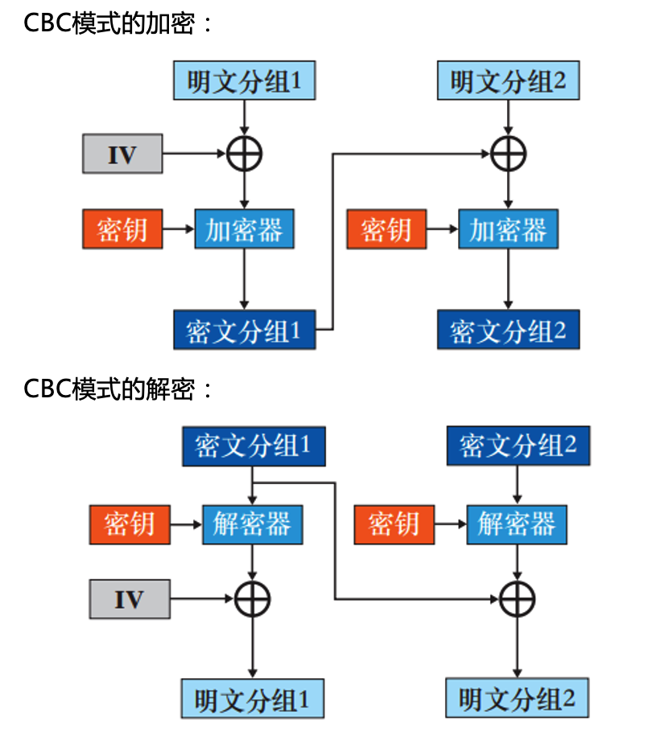

### CFB模式 (P.41)

**CFB模式**的优点包括能够隐藏明文的数据模式，抵抗主动攻击，解密支持并行计算。但加密不支持并行计算，一个密文块传输错误会影响后续密文解密。

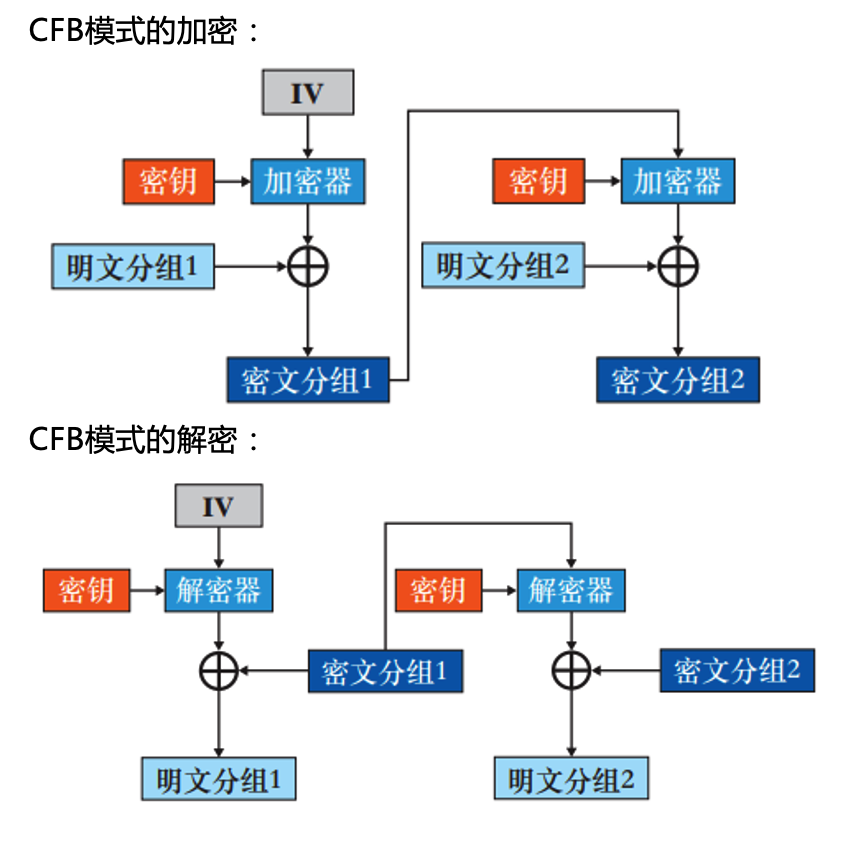

### OFB模式 (P.42)

**OFB模式**在每次加密时，都会将密码算法的输出反馈至输入中，即上一轮加密算法的输出会作为下一轮加密算法的输入。

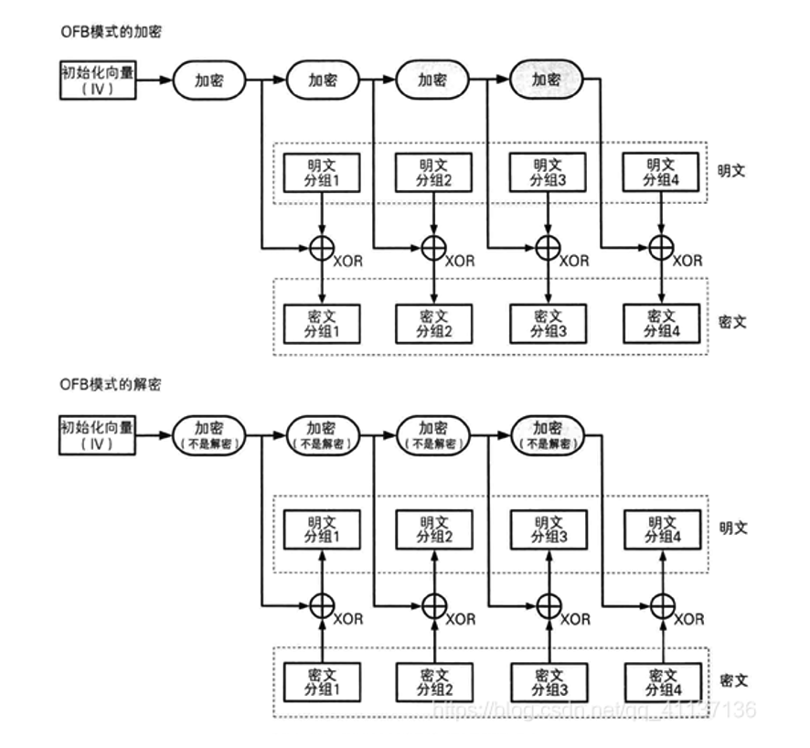

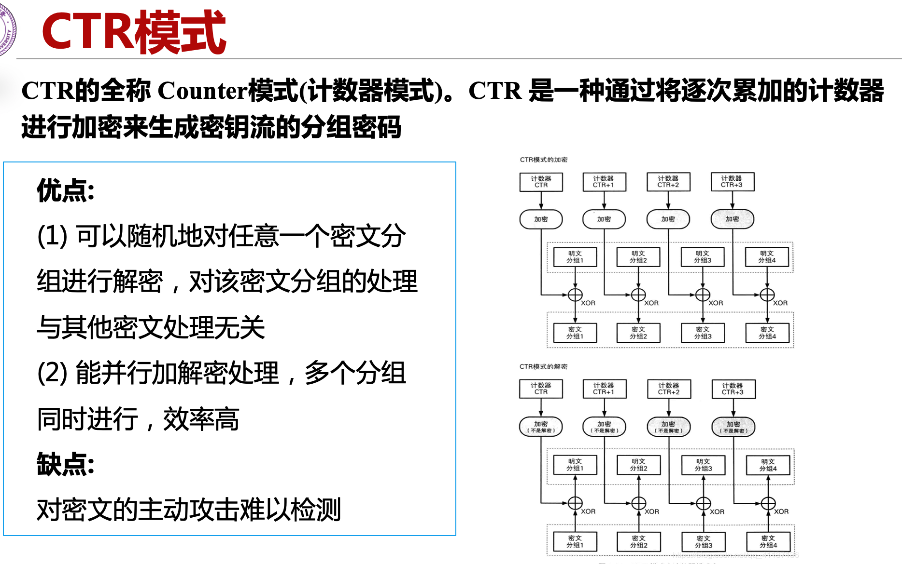

# DES(年年讲年年烂，建议看课件）

考又考不了，讲又非要讲

# 公钥密码

**公钥密码**可以解决密钥分发问题。主要的方法有：

-   **事先共享密钥**：在加密通信之前，以安全的方式将密钥交给接收方。
-   **通过密钥分配中心（Key Distribution Center，KDC）**：当参与加密通信的人过多时，可以使用KDC。当需要进行加密通信时，KDC会生成一个通信密钥，每个人只需和KDC事先共享密钥即可。
-   **通过Diffie-Hellman密钥交换**：进行加密通信的双方仅需要交换一些信息，即使这些信息被窃听，也无法对算法进行解密，而通信双方则可以通过这些信息各自生成相同的密钥。
-   **通过公钥密码**：由于加解密使用不同的密钥，所以无需进行密钥分发。

### 公钥密码系统的加密原理 (P.64-65)

在公钥密码系统中，每个通信实体都有一对密钥（公钥和私钥）。公钥公开，用于加密和验证签名；私钥保密，用于解密和签名。如果A想要向B发送消息，会使用B的公钥进行加密。B收到密文后，使用自己的私钥进行解密。任何人向B发送信息都可以使用同一个密钥（B的公钥）进行加密，但只有B可以使用自己的私钥进行解密。

### 公钥密码系统的签名原理 (P.66)

A向B发送消息，使用A的私钥进行加密（也叫做签名）。B收到密文后，使用A的公钥进行解密（也叫做验证）。

### 公钥密码算法的表示 (P.67)

-   **对称密钥密码**
    -   密钥：会话密钥(Ks)
    -   加密函数：EKs\[P]
    -   对密文C，解密函数：P=DKs\[C]
-   **公开密钥**
    -   (KUa，KRa)
    -   加密/签名：C= EKUb\[P]，EKRa\[P]
    -   解密/验证：P= DKRb\[C]，DKUa\[C]

### 对公开密钥密码算法的要求 (P.68-69)

-   参与方B能容易地生成密钥对(KUb, KRb)。
-   已知KUb，A的加密操作应该是容易的：C=EKUb\[P]。
-   已知KRb，B的解密操作应该是容易的：P=DKRb (C) =DKRb (EKUb (P))。
-   已知KUb，求KRb应该是在计算上不可行的。
-   已知KUb和C，欲恢复P应该是在计算上不可行的。

### 公钥密码算法的误解 (P.603)

以下列出了三个对公钥密码算法的常见误解：

1.  公开密钥算法比对称密钥密码算法更安全：事实上，任何一种算法的安全性都依赖于密钥长度和破译密码的工作量。从抗分析的角度来看，没有哪一种算法是绝对优越的。
2.  公开密钥算法使对称密钥成为过时的技术：事实上，公开密钥算法运行速度较慢，只能用在密钥管理和数字签名上。因此，对称密钥密码算法仍将长期存在。
3.  使用公开密钥加密，密钥分配非常简单：事实上，密钥分配既不简单也不有效。

# RSA算法简介 (P.70)

RSA算法是由Ron Rivest、Adi Shamir和Leonard Adleman开发的一种公钥加密算法。RSA的安全性基于大数分解的难度。RSA已经成为事实上的工业标准，可用于公钥密码和数字签名。

### RSA算法的诞生 (P.71)

1977年，Rivest、Shamir和Adleman在MIT合作发表了一篇完整描述RSA算法的论文。这三个人风格迥异，但组成了一个技能互补的完美团队。

### RSA算法的性能表现 (P.73, 74)

RSA的安全性主要取决于对大数分解的难度。在实际运行中，RSA的速度比DES慢，无论是在软件还是硬件上的实现。

### RSA算法的操作过程 (P.604-608)

RSA算法的操作过程包括密钥产生和加密/解密两个部分。

**密钥产生**：取两个大素数p和q，计算n=pq，公开n；计算欧拉函数ϕ(n)=(p-1)(q-1)，选取一个与ϕ(n)互素的整数e，使得gcd(e, ϕ(n))=1，1\<e<ϕ(n)；找到一个整数d，使得de≡1 (mod ϕ(n))，将d保密。

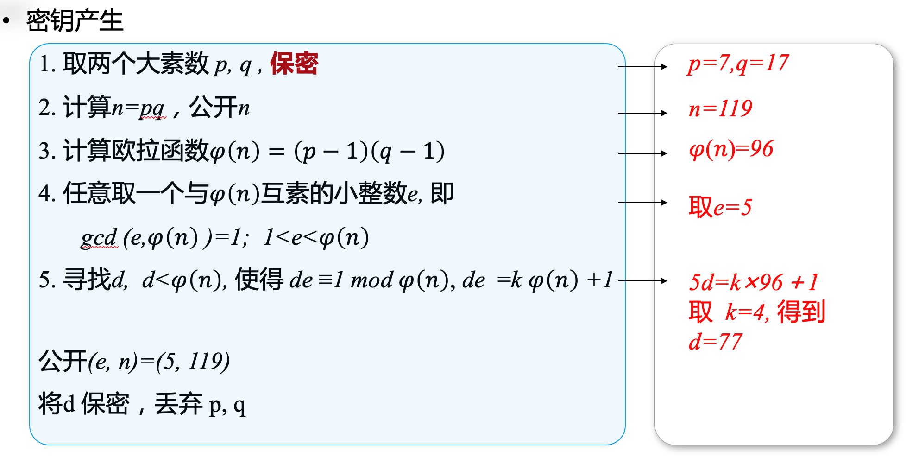

**加密/解密**：公开密钥为KU={e, n}，秘密密钥为KR={d, n}。加密过程为C=M^e mod n，解密过程为M=C^d mod n。

### 公钥密码系统的应用 (P.77)

公钥密码系统主要用于加密/解密、数字签名和密钥交换。例如，RSA可以用于这三种应用，而Diffie-Hellman只能用于密钥交换，DSA则只能用于数字签名。

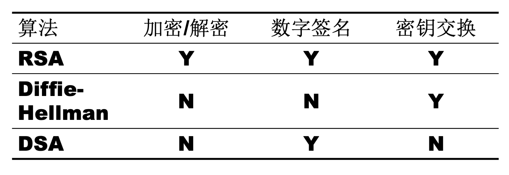

# 摘要与签名

### 散列函数 (P.80)

**散列函数**，又称哈希（Hash）函数，它可以把任意长度的消息压缩为固定长度的二进制串：散列值(hash value)：ℎ = 𝐻(𝑚)。散列函数是进行消息认证的基本方法，主要用于消息完整性检测和数字签名。

### 散列函数的性质 (P.82)

1.  可以根据任意长度的消息计算出固定长度的散列值。
2.  能够快速计算出散列值。

### 散列函数的安全性：HASH 碰撞 (P.84)

哈希碰撞是指不同的输入产生相同的哈希输出。这种情况在理论上是可能的，因为哈希函数接受任意长度的输入，但输出的长度是固定的。所以，存在两个不同的输入产生相同输出的可能性。如果这种碰撞能在实践中找到，那么哈希函数就被认为是不安全的。

### 哈希算法实例 (P.87)

-   **MD5**: 生成128位的哈希值，广泛用于确保信息传输的完整无误。
-   **SHA-1**: 安全哈希算法，主要用于各种安全认证中，生成160位的哈希值。
-   **SHA-256**: 属于SHA-2标准下的哈希算法，生成256位的哈希值，被广泛用于比特币中。

### 散列函数的应用: 比特币 (P.88)

比特币使用了SHA256、RIPEMD160这两种散列函数。SHA256用于区块的头部信息、交易数据、工作量证明、比特币地址等，输出256位的哈希值。而RIPEMD160则用于比特币地址生成，可以让地址更短，输出160位的哈希值。

### SHA256算法 (P.89)

SHA256是SHA-2标准下细分出的一种散列函数。算法的实现主要分为三个步骤：常量初始化，信息预处理，生成摘要。

### 消息认证码 (MAC) (P.97)

**消息认证码（Message Authentication Code）的输入包括任意长度的消息和一个发送者与接受者之间共享的密钥，它可以输出固定长度的数据，这个数据称为**MAC值。

### HMAC (P.97)

**HMAC**是一种使用散列函数来构造消息认证码的方法。该方法所使用的散列函数不仅限于一种，任何高强度的散列函数都可以被用在HMAC。使用SHA-1，SHA-256，所构造的HMAC分别称为HMAC-SHA1，HMAC-SHA256。

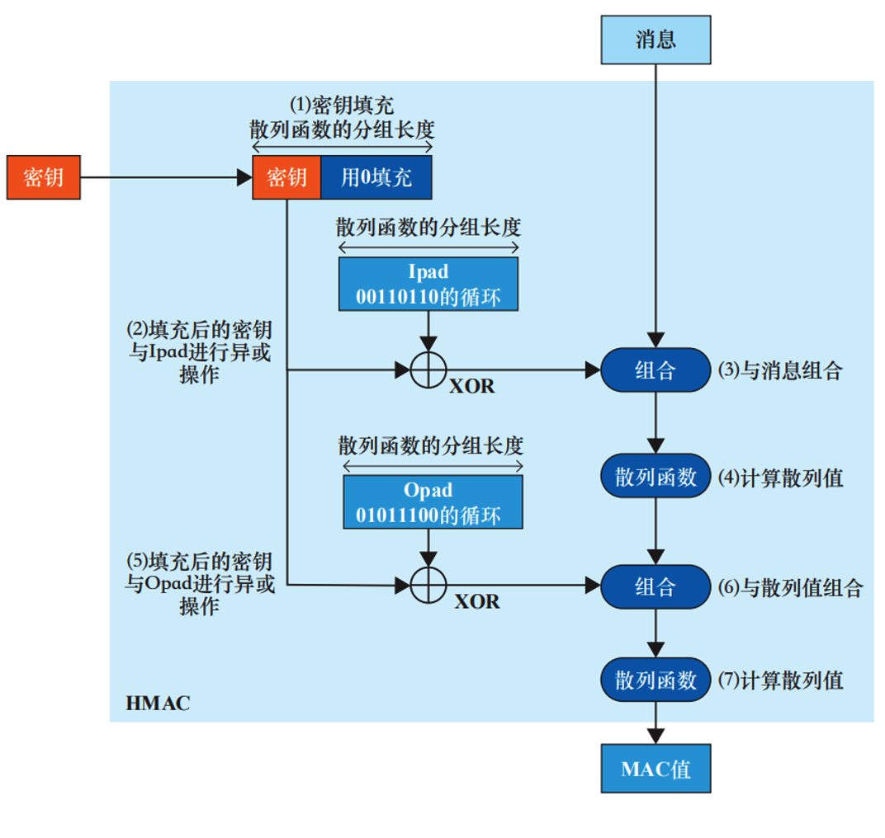

## 公钥密码与数字签名 (P.98)

在**公钥密码**系统中，用公钥进行加密，用私钥进行解密。**数字签名**是用私钥加密的过程，用公钥进行验证。

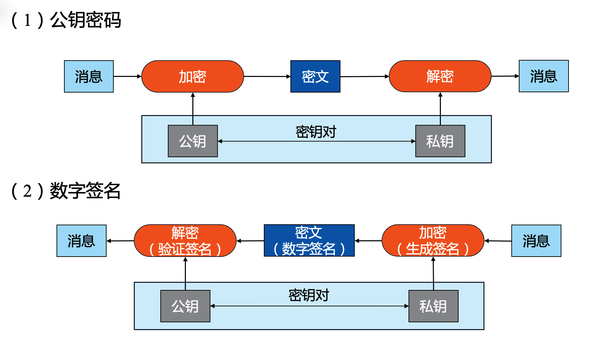

### 数字签名方法 (P.100)

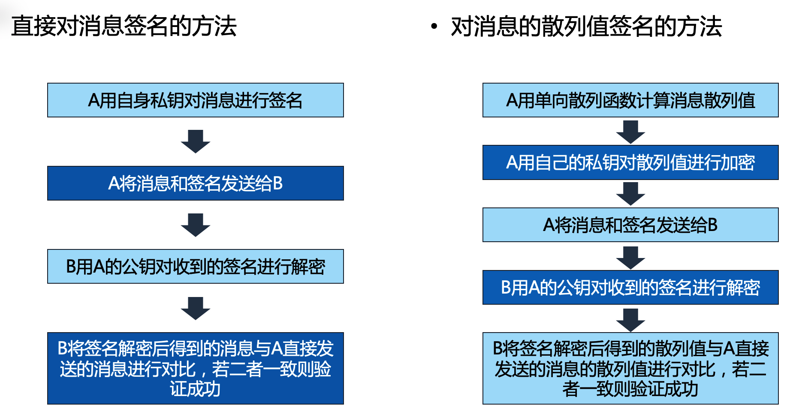

### 数字签名的分类 (P.101)

包括盲签名（签名者不知道代签名文件内容时使用的数字签名）、门限签名（如果一个群体中有n个人，那么至少需要p个人签名才视为有效签名(n>p)）、群签名（一个群体由多个成员组成，某个成员可以代表整个群体来进行数字签名，而且该成员作为签名者可以被验证）、代理签名（密钥的所有者可以将签名权利授予第三方，获得权力的第三方可以进行数字签名）、双重签名（签名者希望有个中间人在他与验证者之间进行验证授权操作）。

### 数字签名的应用 (P.102)

包括网站认证（通过对网站域名信息、主体身份信息、域名权属信息等进行严格鉴证审核，并利用PKI数字签名技术形成不可篡改的认证标识，在互联网终端以安全可靠的方式进行展示，使网民更直观确认网站的真实身份）、

比特币（比特币是一种完全匿名的数字货币，它的身份认证是基于ECDSA，比特币的账户地址就是对公钥计算摘要得到的，并用私钥确认账户拥有者）、

代码签名（如果Windows上的可执行程序程序来源于正规公司

### 密码分析技术 (P.105)

密码分析技术是在未知密钥的前提下，从密文恢复出明文、或者推导出密钥，对密码进行分析的尝试。

### 唯密文攻击(Ciphertext only) (P.106)

分析者有一些消息的密文，都是用同一算法加密的。分析者的目标是恢复尽量多的明文或者推算出密钥。

### 已知明文攻击(Known Plaintext) (P.106)

密码分析者不仅可以得到一些消息的密文，而且也知道这些消息的明文。分析者的任务是得到加密的密钥或者得到一个算法，该算法可以解密用同样的密钥加密的消息。

### 选择明文攻击(Chosen Plaintext) (P.106)

分析者不仅知道一些消息的明文和密文，而且可以选择被加密的明文，这比已知明文攻击更加有效。分析者的任务是得到加密的密钥或者得到一个算法，该算法可以解密用同样的密钥加密的消息。

### 选择密文攻击(Chosen Ciphertext) (P.106)

密码分析者能选择不同的被加密的密文，并可以得到对应的解密的明文，密码分析者的任务是推出密钥。主要针对公钥算法。

### 相关密钥攻击(Related Key) (P.106)

攻击者可以得到被两个不同的钥匙所加密（或解密）得到的密文（或明文）。攻击者不知道这两个钥匙的数值，但知道这两个钥匙之间的关系，比如两个钥匙之间相差一个比特。

### 密码分析技术 (P.107)

密码算法的相对安全性的衡量标准包括破解算法的代价是否大于加密数据本身的价值，以及破解算法的时间是否超过了信息的生命期。对于不同密钥长度的加密，进行穷举密钥搜索所需的平均时间也会大不相同，随着密钥长度的增加，所需的时间将急剧增加。
