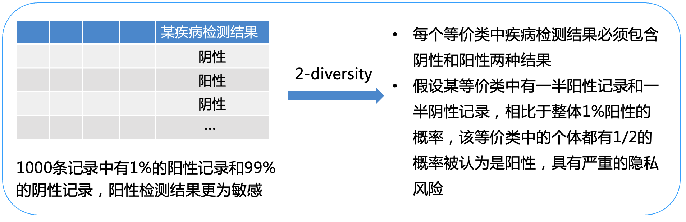
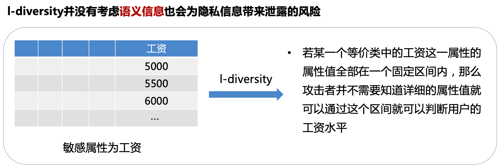
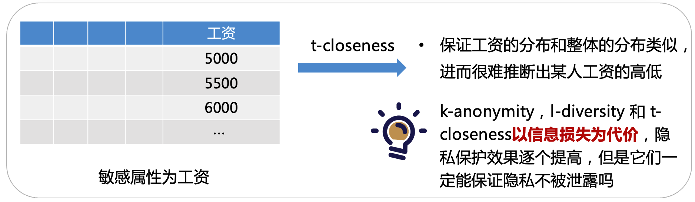

# Chap5

## 隐私保护技术初探

### 隐私保护技术概述

在大量的网络空间数据中获取有用信息时，如何在保护数据相关者的隐私的同时获取有用信息变得尤为重要。数据隐私保护技术的研究主要分为两个方面：**面向数据发布的隐私保护研究**和**面向数据挖掘的隐私保护研究**。

### 面向数据发布的隐私保护

面向数据发布的隐私保护包含以下几个部分：

1.  **基于限制发布的隐私保护**：这种技术在将数据公布给数据挖掘者之前，对数据进行扰动、加密、匿名等处理，将数据中的隐私藏起来。研究主要集中于数据匿名化，例如有选择的发布原始数据、不发布或者发布精度较低的敏感数据。
2.  **基于数据失真的隐私保护**：该技术通过对原始数据进行扰动，目的是隐藏真实数据，只呈现出数据的统计学特征。失真后的数据满足两个条件：保持原本的某些特性不变，且攻击者不能根据失真数据重构出真实的原始数据。此技术主要包括随机化、阻塞、变形、交换等。
3.  **基于数据加密的隐私保护**：这种技术对原始数据进行加密，通过密码机制实现其他参与方对原始数据的不可见性以及数据的无损失性。由于加密技术可解决安全通信的问题，因此多应用于分布式应用。

### 面向数据挖掘的隐私保护

面向数据挖掘的隐私保护包括以下几个部分：

1.  **关联规则的数据挖掘**：关联规则挖掘是数据挖掘领域研究的重点之一，是从大量数据中挖掘数据项之间隐藏的关系，发现数据集中项集之间的关联和规则的过程。例如购物篮分析，寻找商品之间隐藏的关联规则。
2.  **隐私保护的关联规则挖掘**：包含两类方法，一种是修改支持敏感规则的数据，使得规则的置信度和支持度小于一定的阈值而实现规则的隐藏；另一种是不修改数据，而是隐藏生成敏感规则的频繁项集，尽可能降低敏感规则的置信度或者支持度

### 匿名化隐私保护模型

在数据发布过程中，为了保护用户的敏感数据和个人身份之间的对应关系，需要采取匿名化隐私保护模型。传统的匿名化方法往往无法抵抗链接攻击，而 k-anonymity 是一种有效的隐私保护模型，能够解决链接攻击问题。

#### 传统的匿名化方法

传统的匿名化方法包括删除容易关联到个人的属性（如姓名和家庭住址），或者将姓名替换为假名。然而，这些方法存在一定的局限性，无法提供足够的隐私保护，容易受到链接攻击。

#### 链接攻击

链接攻击是指攻击者通过对发布的数据和其他渠道获取的数据进行链接操作，推断出隐藏在匿名化数据中的隐私信息。例如，攻击者可以将医疗数据集与其它公共数据集的准标识符进行联系，从而推断出匿名化数据中的敏感信息。

#### k-anonymity（PPT 第 34 页）

**k-anonymity** 是一种数据匿名化技术，当攻击者尝试链接攻击时，由于任意一条记录的攻击，都会同时关联到等价类中的其他 k-1 条记录，因此攻击者无法确定特定用户。举例来说，病患数据公布的原始版本和其 3-anonymity 版本的比较：

_原始数据_

| 年龄 | 邮政编码 | 疾病   |
| ---- | -------- | ------ |
| 52   | 123023   | 心脏病 |
| 32   | 120156   | 糖尿病 |
| 59   | 123152   | 心脏病 |
| 30   | 120162   | 糖尿病 |
| 56   | 123485   | 心脏病 |
| 35   | 120154   | 哮喘   |

_3-anonymity 版本_

| 年龄 | 邮政编码  | 疾病   |
| ---- | --------- | ------ |
| 5\*  | 123\*\*\* | 心脏病 |
| 5\*  | 123\*\*\* | 心脏病 |
| 5\*  | 123\*\*\* | 心脏病 |
| 3\*  | 1201\*\*  | 糖尿病 |
| 3\*  | 1201\*\*  | 糖尿病 |
| 3\*  | 1201\*\*  | 哮喘   |

#### 同质性攻击和背景知识攻击（PPT 第 35-36 页）

在数据匿名化过程中可能存在的攻击模式包括**同质性攻击**和**背景知识攻击**。同质性攻击是指没有对敏感属性进行约束，最终结果可能造成隐私泄露。例如，如果一名选民的年龄和邮政编码符合第一个等价类要求，那么攻击者可推断该选民可能患有心脏病。

背景知识攻击则是攻击者可以通过掌握的足够的相关背景知识以很高的概率确定敏感数据与个体的对应关系，得到隐私信息。例如，如果一名选民的年龄和邮政编码符合第二个等价类要求，并且攻击者发现他不像是患有哮喘，那么攻击者可推断该选民可能患有糖尿病。

#### l-diversity（PPT 第 37-39 页）

l-diversity 在 k-anonymity 的基础上，要求保证每一个等价类的敏感属性至少有 l 个不同的值，即每个用户的敏感属性值在等价类中可以找到与此值不同的至少 l-1 个属性值，使攻击者最多只能以 1/l 的概率确认某个用户的敏感信息

但无法保证隐私不被泄露



没有考虑语义信息也会成为泄露的风险



#### t-closeness（P41）

在 k-anonymity 和 l-diversity 的基础上，t-closeness 考虑了敏感属性的分布问题，**要求所有等价类中的敏感属性的分布尽量接近该敏感属性的全局分布**，差异不能超过阈值 t



## 数据匿名化方法（页码：42）

数据匿名化的方法包括**泛化**、**抑制**、**聚类**、**微聚集**、**分解**和**置换**等。泛化和抑制是主流方法，它们在匿名化过程中保持了发布前后数据的真实性和一致性。

- **泛化（Generalization）**：这是通过使用更抽象、概括的值或区间来替代精确值的方法。
- **抑制（Suppression）**：这种方法是将数据表中的数据直接删除或隐藏。
- **聚类（Clustering）**：这种方法根据给定的规则将数据集分成各种类簇，尽可能保证类簇内对象相似，不同类簇的对象相异。
- **微聚集（Micro-aggregation）**：这种方法是将相似的数据划分在同一个类中，每个类至少有 k 条记录，用类质心代替类中所有记录的准标识符属性值。
- **分解（Decomposition）**：这种方法根据敏感属性值对数据表分组，尽量使得同一组的敏感属性值不同，将分组后的数据表拆分为分别包含准标识符属性信息和包含敏感属性信息的两张表。
- **置换（Permutation）**：这种方法是对数据表分组，把每组内的敏感属性值随机交换，打乱顺序，再拆分数据表，对外发布。

### 泛化（页码：43-44）

泛化是一种常用的数据匿名化方法，其思想是将准标识符的属性用更一般的值或者区间代替。它不会引入错误数据，方法简单，泛化后的数据适用性强，对数据的使用不需要很强的专业知识。但是其预定义泛化树没有统一标准，信息损失大，对不同类型数据的信息损失度量标准不同。

#### 泛化树（页码：44）

泛化树可以看作是一种将底层取值泛化为高层取值的结构，每层的取值构成一个泛化域。底层的取值最具体，顶层的取值最模糊。数值型数据泛化树和分类型数据泛化树是两种常见的泛化树形式。

- **数值型数据泛化树**：对于数值型属性，可以使用泛化树进行泛化。底层的具体取值被一个覆盖精确数值的区间代替，而上层的取值则逐渐变得更加抽象和概括。这样，可以保持数据的真实性和一致性，同时减少敏感信息的泄露。
- **分类型数据泛化树**：对于分类型属性，可以使用泛化树进行泛化。底层的具体取值被一个更一般的值代替，而上层的取值则逐渐变得更加抽象和概括。这样，可以保持数据的真实性和一致性，同时降低敏感信息的泄露风险。

#### 域泛化（全局泛化）与值泛化（局部泛化）（页码：45-46）

在数据匿名化过程中，可以采用**域泛化**（全局泛化）和**值泛化**（局部泛化）两种策略。

- **域泛化**：域泛化将一个给定的属性域从底层开始同时向上泛化，直到满足隐私保护要求，然后停止泛化。在域泛化中，同一个属性的全部值必须在同一层上进行泛化。域泛化分为全域泛化和子树泛化两种方式。
  - **全域泛化**：在泛化树中，同一个父节点下的所有子节点要么全部泛化，要么全部不泛化。全域泛化可以确保一致性，但可能导致较大的信息损失。
  - **子树泛化**：在泛化树中，对部分子节点进行泛化，而其他兄弟节点不要求泛化。父节点代替泛化的子节点进行数据发布。子树泛化相比全域泛化可以减少信息损失，但可能引入一些不一致性。
- **值泛化**：值泛化将原始属性域中的每个值直接泛化成一般域中的唯一值。在值泛化中，可以对多个属性的值同时进行泛化，只需要对不符合限制要求的等价类进行泛化，要求一个等价类中所有记录都泛化成相同的值。值泛化可以保持数据的一致性，但可能引入一些不一致性。

### 抑制（P48）

**抑制**（Suppression），也称为隐藏或隐匿，是一种数据匿名化方法，用于将准标识符属性值从数据集中直接删除或用代表不确定值的符号（如" \*"）替代。抑制可以与泛化方法结合使用。

在抑制中，可以采用以下三种方式：

- **记录抑制**：对数据表中的某条记录进行抑制处理，即完全删除该记录，使其无法识别。
- **值抑制**：对数据表中某个属性的部分值进行抑制处理，即用符号或其他模糊化方法替换一部分属性值，以减少敏感信息的泄露。
- **单元抑制**：对数据表中某个属性的所有值进行抑制处理，即完全删除该属性，使其无法被使用或分析。

抑制方法可以用于敏感数据的保护，但需要权衡数据可用性和隐私保护之间的平衡。

## 差分隐私(P49)

差分隐私是一种严格的、可证明的隐私保护模型，相对于传统的匿名化方法，它提供了更严格的隐私保护。与匿名化相比，差分隐私具有以下特点：

- **严格定义的隐私保护**：差分隐私对隐私保护进行了严格的定义，并提供了量化评估方法，使不同参数处理下的数据集所提供的隐私保护水平具有可比较性。
- **抵抗背景知识攻击**：差分隐私假设攻击者掌握最大的知识背景，即能够获得除目标记录外所有其他记录的信息。因此，差分隐私的设计考虑了更强的攻击模型，能够更好地保护隐私。
- **严格的隐私保护证明**：差分隐私提供了严格和科学的方法来证明其隐私保护水平。当模型参数改变时，可以对其隐私保护水平进行定量分析，以便在隐私与数据可用性之间进行权衡。

### 差分隐私基础(P53)

在差分隐私中，数据集的各种查询被定义为查询（Query），并用一组查询$F = f1, f2, ⋯$ 来表示。隐私保护机制是指对查询$F$的结果进行处理的算法$M$，使其满足隐私保护的条件。

在差分隐私中，邻近数据集（Adjacent Dataset）是指具有相同属性结构的两个数据集 D 和 D'，它们的对称差表示为$D∆D'$，其中$｜D∆D'｜$表示$D∆D'$中记录的数量。如果 D∆D' = 1，则称 D 和 D'为邻近数据集。

### 数值型差分隐私和非数值型差分隐私匿名化与差分隐私

差分隐私在数据匿名化方面与传统的匿名化方法有所不同。传统的匿名化方法不能提供足够的数学保障，没有严格定义攻击模型，无法抵抗背景知识攻击，并且难以提供严格和科学的方法来证明其隐私保护水平。相比之下，差分隐私提供了更强的隐私保护，并且能够提供严格的定义和量化评估方法。

### 差分攻击

差分攻击是一种针对差分隐私的隐私泄露攻击方式。例如，在计数查询服务中，查询数据集中前 𝑖 行患病的记录数量，如果已知某个用户的记录是否患病，可以通过查询结果的变化推断该用户是否患病。差分隐私要求对最终发布的查询结果几乎没有影响，以抵抗这种差分攻击。

### 差分隐私思想

差分隐私的核心思想是通过引入随机化扰动的方式，在查询结果中添加噪声，从而保护个体隐私。随机算法 M 会对信息进行扰动，使得同一查询在两个数据集上产生相同结果的概率的比值接近于 1。这样可以保证任意一个个体在数据集中或者不在数据集中时，对最终发布的查询结果几乎没有影响。

### 差分隐私定义

差分隐私 ( Differential Privacy，DP ) 的定义：设有一个随机算法 M ， $P_{M}$ 为算法 $M$ 所有可能 的输出构成的集合，如果对于任意两个邻近数据集 $D$ 和 $D^{\prime}$ 以及 $ P*{M} $的任意子集 $S*{M}$ ，算法 M 满足

$$
P_{r}\left[M(D) \in S_{M}\right] \leq \exp (\varepsilon) \times P_{r}\left[M\left(D^{\prime}\right) \in S_{M}\right]
$$

则称算法 M 提供 $\varepsilon$- 差分隐私保护，其中参数$ \varepsilon $ 称为隐私保护预算

如果上述条件成立，则称算法 M 提供 𝜀-差分隐私保护，其中 𝜀 称为隐私保护预算。

- 当 𝜀 = 0 时，攻击者无法区分相邻数据集，保护程度最高，但数据可用性最差。
- 当 𝜀 增大时，保护程度逐渐降低，𝜀 过大会造成隐私泄露。
- 通常，𝜀 取较小的值，如 0.01、0.1 或 ln 2、ln 3 等。𝜀 的取值应结合具体需求设定，以平衡输出结果的安全性和可用性。

差分隐私通过严格定义和数学方法的引入，提供了一种可靠的隐私保护模型，能够在隐私和数据可用性之间取得平衡。

## 差分隐私的实现(P56)

差分隐私可以通过在查询函数的返回值中加入噪声来实现隐私保护。这种噪声的加入可以使用不同的机制来实现，例如拉普拉斯机制和高斯机制。

### 拉普拉斯机制

拉普拉斯机制是差分隐私中常用的一种实现方式，适用于处理数值型的数据。它通过在查询结果中加入满足拉普拉斯分布的随机噪声来保护隐私。具体来说，对于给定的数据集 D 和函数 f: D → R，全局敏感度为 Δf，拉普拉斯机制可以定义如下：

如果随机算法 M 的输出结果满足 M(D) = f(D) + Lap(Δf/ε)，其中 Lap(b)表示服从尺度参数为 b 的拉普拉斯分布的随机噪声，那么算法 M 提供(ε, 0)-差分隐私保护。

在拉普拉斯机制中，随着 ε 的减小，加入的噪声增加，对输出结果的混淆程度增强，从而提高了隐私保护的程度。然而，当全局敏感度 Δf 较大时，加入的噪声也会增加，可能对数据提供过度的保护，降低了数据的可用性。

### 高斯机制

高斯机制是另一种常用的差分隐私实现方式，也适用于处理数值型的数据。与拉普拉斯机制类似，高斯机制通过在查询结果中加入满足高斯分布的随机噪声来保护隐私。具体来说，对于给定的数据集 D 和函数 f: D → R，全局敏感度为 Δf，高斯机制可以定义如下：

如果随机算法 M 的输出结果满足 M(D) = f(D) + N(0,σ^2)，其中 N(0,σ^2)表示服从均值为 0，方差为 σ^2 的高斯分布的随机噪声，那么算法 M 提供(ε, δ)-差分隐私保护。

与拉普拉斯机制相比，高斯机制提供了松弛的差分隐私保护，其中 δ 用于控制差分隐私的概率失效率。当 ε 较小时，加入的噪声较大，保护程度较高，但数据的可用性可能会降低。

### 全局敏感度和局部敏感度

在差分隐私中，全局敏感度和局部敏感度用于衡量查询函数在邻近数据集上的敏感度。

- 全局敏感度是指在任意一对邻近数据集 D 和 D'上，查询函数 f 的输出结果之间的最大变化范围。它与数据集无关，由查询函数本身决定。
- 局部敏感度是指对于给定的数据集 D 和它的任意邻近数据集 D'，查询函数 f 在 D 上的局部敏感度。它由查询函数和给定数据集中的数据共同决定。

全局敏感度和局部敏感度是衡量查询函数敏感度的重要指标，可以用来确定加入的噪声的大小，从而在隐私保护和数据可用性之间取得平衡。

### 数值型差分隐私：拉普拉斯和高斯机制

在处理数值型数据时，可以使用拉普拉斯机制或高斯机制实现差分隐私。

拉普拉斯机制使用拉普拉斯分布来生成随机噪声，并将其加到查询结果中。拉普拉斯分布是一种连续概率分布，具有位置参数和尺度参数。拉普拉斯机制提供严格的(ε, 0)-差分隐私保护。尺度参数的选择会影响加入的噪声量，较大的尺度参数会降低数据的可用性，而较小的尺度参数可能导致隐私泄露。

高斯机制使用高斯分布来生成随机噪声，并将其加到查询结果中。高斯分布是另一种连续概率分布，具有均值和方差。高斯机制提供松弛的(ε, δ)-差分隐私保护，其中 δ 用于控制差分隐私的概率失效率。方差的选择会影响加入的噪声量，较大的方差会降低数据的可用性，而较小的方差可能导致隐私泄露。

在选择拉普拉斯或高斯机制时，需要平衡隐私保护和数据可用性，并根据具体的应用需求选择合适的参数。较小的 ε 值表示更强的隐私保护，但可能导致较大的噪声和较低的数据可用性。

### 非数值型差分隐私：指数机制

对于非数值型（离散型）的数据，可以使用指数机制实现差分隐私。指数机制适用于处理具有离散输出域的查询。

指数机制使用指数分布来生成随机噪声，并根据

查询的可用性函数对输出结果进行加权。可用性函数衡量了输出结果的优劣程度。指数机制提供(ε, 0)-差分隐私保护。

在指数机制中，根据可用性函数对输出结果进行加权，然后通过归一化来确定每个输出的概率值。在选择 ε 的值时，需要在保障数据可用性的前提下进行权衡，根据具体的需求设定合适的 ε 值。

总结起来，差分隐私的实现可以使用拉普拉斯机制和高斯机制处理数值型数据，而非数值型数据可以使用指数机制来保护隐私。选择适当的机制和参数可以在隐私保护和数据可用性之间取得平衡，确保数据的隐私得到有效保护。

## 同态加密(P69)

同态加密是一种特殊的加密技术，它允许在加密状态下对密文进行运算，而无需解密。在同态加密中，数据可以保持加密状态，同时进行计算和处理，最终得到的结果可以在解密后与明文的计算结果相匹配。

### 同态加密基础

同态加密的概念最早在 1978 年由 Ronald L. Rivest、Leonard Adleman 和 Michael L. Dertouzos 提出，以银行为应用背景。他们提出了同态加密（Homomorphic Cryptosystem）的概念，而后者的构造者分别是 RSA 算法的发明者 Ronald L. Rivest 和 Leonard Adleman。

同态加密的基本思想是对密文进行操作，而计算结果的解密值与对应明文的计算结果相同。这种特性使得同态加密在安全数据外包的场景中具有重要应用。

### 同态加密的应用场景：安全的数据外包

同态加密在安全的数据外包中具有重要应用。在某些情况下，医院等机构可能拥有大量的敏感数据，但却没有足够的计算能力。而数据计算平台拥有计算能力，但其可信度存在疑虑。

通过同态加密技术，可以将数据安全地外包给数据计算方，而不必担心隐私泄露。数据所有者可以对数据进行同态加密，然后将加密后的数据传输给计算方。计算方可以在不知道原始数据的情况下对密文进行计算和处理，并返回处理后的结果。最后，数据所有者使用其私钥对结果进行解密，获得最终的处理结果。

通过同态加密实现安全的数据外包，既保护了数据隐私，又充分利用了数据计算平台的计算能力，实现了数据隐私和计算能力之间的平衡。

### 组成

同态加密是一种特殊的加密技术，可以在加密的状态下进行各种计算操作，而不需要解密数据。它具有以下四个组成部分：

- **KeyGen 算法**：通过计算安全参数生成一对公私钥。
- **Encrypt 算法**：使用公钥将明文加密为密文。
- **Evaluate 算法**：在密文上进行运算，例如加法或乘法。
- **Decrypt 算法**：使用私钥将密文解密为明文。

### 同态加密的发展

同态加密的发展经历了以下几个阶段：

1.  **仅支持加法同态的加密体制**：最早的同态加密体制只支持加法同态或乘法同态，但不能同时满足两者。
2.  **半同态加密**（Partially Homomorphic Encryption，PHE）：半同态加密体制同时满足加法同态和乘法同态的性质，但只能进行有限次的加和乘运算。
3.  **浅同态加密**（Somewhat Homomorphic Encryption，SWHE）：浅同态加密体制也同时满足加法同态和乘法同态的性质，但可以进行任意多次加和乘运算。
4.  **全同态加密**（Fully Homomorphic Encryption，FHE）：全同态加密体制是最理想的同态加密形式，它可以在不解密的条件下对加密数据进行任何可以在明文上进行的运算，实现了深度和无限的数据分析，对加密信息进行深入分析而不影响其保密性。

尽管同态加密的研究经历了 40 多年的发展，直到 2009 年，斯坦福大学的博士生 Craig Gentry 才构造出了第一个真正的全同态加密体制。目前，全同态加密仍面临着复杂度问题，离实际应用仍有一定距离。

### 同态加密的应用

同态加密在许多领域有着广泛的应用。以下是一些常见的应用场景：

- **医疗机构的数据分析**：在医疗机构中，数据处理能力较弱，可以借助云服务商提供的计算服务。使用同态加密，医疗数据可以在加密的状态下存储和计算，而不泄露隐私信息。云服务商可以进行数据搜索、分析和处理等功能，同时保护数据隐私。
- **电子投票**：同态加密可以用于设计安全的电子选举系统。统计方可以在不知道投票者投票内容的情况下对投票结果进行统计，既保证

了投票者的隐私安全，又能够保证投票结果的公正性。

### 同态加密的优势与挑战

同态加密具有以下优势：

- **降低计算代价**：同态加密可以对多个密文进行计算后再解密，降低了计算代价。
- **降低通信代价**：同态加密可实现无密钥方对密文的计算，无需经过密钥方，降低了通信代价。
- **保证数据安全性**：同态加密可以实现让解密方只能获知最终的结果，而无法获得每个密文的消息，从而保证了信息的安全性。

然而，同态加密也面临一些挑战：

- **计算效率**：当前的同态加密方案的计算复杂度较高，如何设计高效的全同态加密方案仍然是一个问题。
- **安全性**：同态加密方案大多基于未论证的困难问题，寻找可论证的困难问题仍然是一个挑战。
- **噪音消除**：同态加密需要额外的消除噪音算法，如何设计具有自然同态性的全同态加密方案仍然是一个问题。

尽管同态加密正逐步向实用性靠近，但其安全性和实用性方面的研究还有很长的路要走。

## 半同态加密

在一个加密方案中，如果加密算法和解密算法满足以下条件：

$$
D(Enc(a) ⊗ Enc(b)) = a ⊕ b
$$

其中，$⊗$ 表示在密文域上的运算，$⊕$ 表示在明文域上的运算，那么该加密方案被称为半同态加密。

半同态加密分为乘法同态加密和加法同态加密：

- 乘法同态加密：当 $⊗$ 表示乘法时，称为乘法同态加密。典型的乘法同态加密算法有：
  - RSA 公钥加密算法（1977 年提出）
  - ElGamal 公钥加密算法（1985 年提出）
- 加法同态加密：当 $⊗$ 表示加法时，称为加法同态加密。典型的加法同态加密算法有：
  - Paillier 公钥加密算法（1999 年提出），是最常用且最具实用性的加法同态加密算法。

### ElGamal 乘法同态加密

ElGamal 乘法同态加密算法是由 Taher ElGamal 于 1985 年基于有限域上的离散对数困难假设设计的。该算法具有乘法同态性质，即对于任意的明文消息 `m` 和 `m'`，满足以下等式：

```text
Enc(m) ⊗ Enc(m') = Enc(m ⊗ m')
```

其中，`Enc(m)` 表示对消息 `m` 进行加密得到的密文。

ElGamal 加密系统的公钥为 `pk = (G, q, g, h)`，其中 `G` 是一个群，`q` 是一个素数，`g` 是 `G` 中的生成元，`h` 是 `g` 的某个幂次。

离散对数问题是指在有限域中找到满足 `β ≡ α^x (mod p)` 的整数 `x` 的困难问题，其中 `p` 是素数，`α` 是 `p` 的一个原根，`β` 是给定的整数。

ElGamal 乘法同态加密系统利用离散对数问题的困难性假设，实现了乘法同态性质。

### Paillier 加法同态加密

Paillier 加法同态加密算法是由 Pascal Paillier 于 1999 年提出的，其安全性基于判定合数剩余类的问题。

Paillier 加法同态加密算法是最常用且最具实用性的加法同态加密算法之一。它被广泛应用于加密信号处理和第三方数据处理领域。

Paillier 加法同态加密算法的公钥为 \`pk = (

N, g)`，私钥为 `(λ, μ)`。其中，`N`是两个大素数`p`和`q` 的乘积，`g`是模`N^2`中的一个生成元。私钥的计算涉及`p`和`q`的最小公倍数`λ`，以及 `g`的模`N`的逆元`μ\`。

Paillier 加法同态加密算法具有加法同态性质，即对于任意的明文消息 `m` 和 `m'`，满足以下等式：

```text
Enc(m) ⊗ Enc(m') = Enc(m + m')
```

Paillier 加法同态加密算法通过加法同态性质实现了对密文的加法操作，可以进行任意次的加法同态操作。

### 全同态加密

全同态加密是指同时满足加法同态性和乘法同态性的加密方案，可以进行任意多次加和乘运算的加密函数。全同态加密方案的定义如下：

```text
D(f(Enc(m1), Enc(m2), ..., Enc(mn))) = f(m1, m2, ..., mn)
```

全同态加密的研究长期以来一直是密码学领域的一个重要问题。直到 2009 年，Craig Gentry 基于理想格构造出了首个全同态加密方案，但在实际应用中效率较低。随后的研究逐渐改进了全同态加密方案的效率，并提出了第二代和第三代全同态加密方案。

全同态加密具有强大的功能，被誉为密码学界的"圣杯"。然而，由于计算复杂度较高，加密算法设计更加复杂，整体性能远不及半同态加密算法。目前，全同态加密仍然是一个热门的研究领域，尚在不断发展和完善中。

## 安全多方计算(P93)

安全多方计算（Secure Multi-Party Computation，MPC）是一种解决互不信任的多方参与者在保护各自数据的前提下进行合作计算的方法。在安全多方计算中，多个参与者希望共同计算一个函数，同时保护各自的隐私或秘密数据，而不愿意让其他参与者知晓自己提供的信息。

### 安全多方计算基础

安全多方计算的基础是解决一组互不信任的参与方之间如何协同计算并保护隐私的问题。例如，多家医院想要合作使用医疗数据进行科学研究，但为了保护患者隐私，不能直接共享数据。在安全多方计算中，参与方可以安全地合作使用数据，同时保护各自的隐私。

### 安全多方计算的提出

安全多方计算起源于姚期智教授在 1982 年提出的百万富翁问题。它解决了一组互不信任的参与方之间保护隐私的协同计算问题。安全多方计算协议使得参与者能够进行合作计算，而不需要彼此泄露输入信息，从而保护隐私。

### 安全多方计算的形式化描述

安全多方计算的目标是在无可信第三方的情况下安全地计算一个约定函数，同时要求每个参与方除了计算结果外不能得到其他参与方的任何输入信息。安全多方计算需要满足以下特征：

- **输入独立性**：各方能独立输入数据，计算时不泄露本地数据。
- **计算正确性**：计算结束后各方能够得到正确的计算结果。
- **去中心化性**：各参与方地位平等，提供了去中心化的计算模式。

### 安全多方计算的威胁模型

安全多方计算的威胁模型分为三种：诚实模型、半诚实模型和恶意模型。

- **诚实模型**：参与者按照协议要求行动，不提供虚假数据，不泄露、窃听数据，不终止协议，完全按照协议执行。
- **半诚实模型**：在诚实模型基础上保留所有收集到的信息，推断其他参与者的秘密信息。
- **恶意模型**：无视协议要求，可能提供虚假数据、泄露数据、窃听甚至终止协议。

### 安全多方计算的计算模型

安全多方计算的计算模型主要有基于"可信第三方"的计算模型、交互计算模型和外包计算模型。

- **基于"可信第三方"的计算模型**：参与方得到计算结果，可信第三方得到参与方的输入信息和计算结果，信息的保密性由可信第三方来保证。然而，在实际情况下很难找到完全可信的第三方，所以这种模型很少使用。
- **交互计算模型**：参与方按照协议步骤执行计算，按协议的要求将中间结果发送给其他参与方，同时接收其他参与方计算的中间结果，信息的保密性由协议的安全性来保证。这是安全多方计算中最常用的模型，提供了一种去中心化的计算方式。
- **外包计算模型**：各个参与方希望使用云计算提供的计算资源，但不想直接将信息委托给云计算服务提供商，也不想让其得知计算结果。参与方将信息处理后存储在外包服务器上，由外包处理器对所有参与方的秘密信息进行计算，并将结果发送给各参与方。信息的保密性由协议的安全性来保证。

### 基本密码协议

在安全多方计算中，基本密码协议是实现安全多方计算的关键工具。它包括茫然传输协议（Oblivious Transfer, OT）、混淆电路协议（Garbled Circuit, GC）和秘密共享协议（Secret Sharing）等。这些协议使用了多种密码学技术，如同态加密技术，来实现安全的计算过程。

### 安全多方计算的应用

安全多方计算的优势在于能够在保护隐私的同时进行计算，并具有较高的安全性和准确性。它被广泛应用于以下领域：

- **门限签名**：将私钥拆分为多个秘密分片，只有在达到门限值的参与者共同协作时才能生成有效的签名。
- **电子拍卖**：在不直接公开竞拍者的出价情况下，能够计算出所有参与者输入的最大值或最小值，使得在线拍卖成为现实。
- **联合数据查询**：多个数据库可以共同进行数据查询，使用安全多方计算保护各数据库的私有信息或知识版权。
- 其他领域：安全多方计算涉
